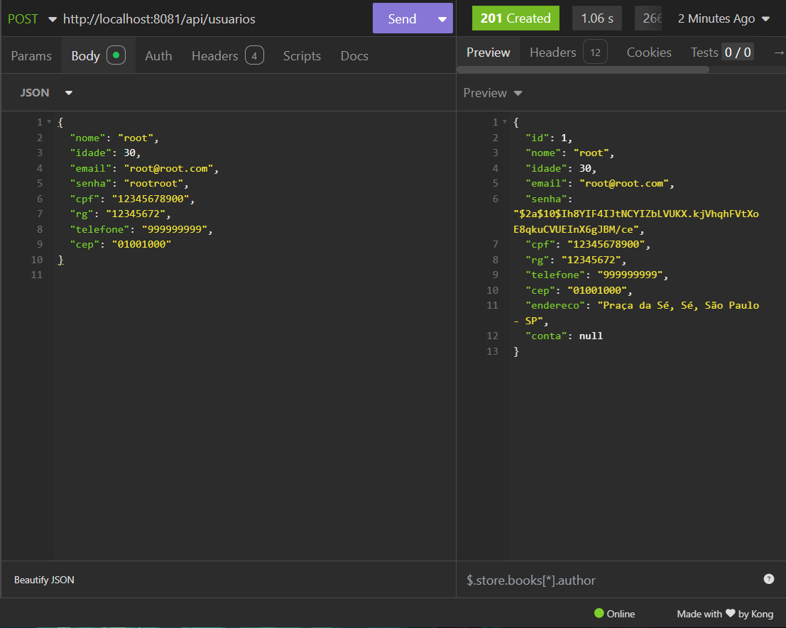

# BancoSA - Backend

## Descrição do Projeto
Desenvolvi uma API em **Java** com **Spring** para cadastrar contas bancarias, consumindo uma API que gera o endereço a partir do CEP inserido, além disso fiz um sistema de autenticação com **Spring Security**, tanto a API quanto o banco de dados estão em um container no **Docker**.

Intalção do projeto no docker-compose, com o seguinte comando no terminal bash: **docker-compose up -d**

## Tecnologias Utilizadas
- **Java**: 17.
- **Spring Boot**: Framework utilizado.
- **Banco de Dados**: PostgreSQL.
- **Ferramentas**: Maven, Docker Compose, Spring Security, Swagger.
- **API Externa**: Ex: ViaCep.

## Funcionalidades

- Cadastro de contas
- Login e autenticação
- CRUD de recursos
- Integração com APIs externas
- Validação de dados
- 

**Imagens**

  
  
  
  
  

